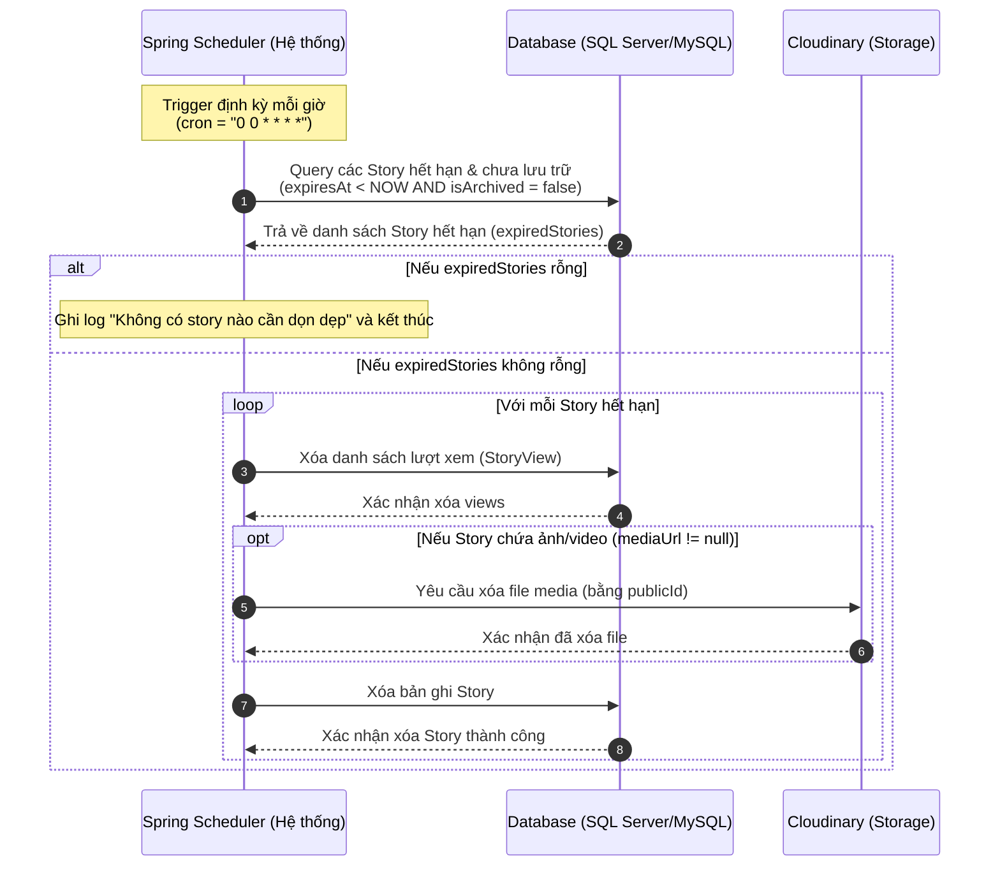

# Tài Liệu Giải Đáp Quy Trình Nghiệp Vụ Mạng Xã Hội (Q&A Features)

Tài liệu này giải đáp chi tiết các câu hỏi nghiệp vụ dựa trên phân tích trực tiếp từ mã nguồn thực tế của dự án Social Network.

---

## 1. Bảng tin (News Feed)

### **Câu hỏi:** Hiển thị bài của ai? Bạn bè, nhóm đã tham gia, bài public, bài mới nhất hay có thuật toán xếp hạng?

### **Giải đáp:**
News Feed hiển thị các bài viết từ các nguồn sau:
* **Chính mình:** Các bài viết do chính tài khoản đang đăng nhập tạo ra.
* **Người mình theo dõi (Following):** Chỉ hiển thị các bài viết ở chế độ **công khai** (`PUBLIC`) của họ.
* **Bạn bè (Friends):** Các bài viết ở chế độ **bạn bè** (`FRIENDS`) từ những người đã được chấp nhận kết bạn (`status = ACCEPTED`).
* **Nhóm đã tham gia (Social Groups):** Các bài viết được đăng trong các Nhóm mà người dùng đã là thành viên chính thức (`approved = true`) và các bài viết đó phải có trạng thái đã duyệt (`groupPostStatus = APPROVED`).

### **Cơ chế lọc và xếp hạng:**
* **Chặn người dùng (Block):** Các bài viết của những người dùng nằm trong danh sách chặn hai chiều (`status = BLOCKED` giữa hai người) sẽ hoàn toàn bị loại bỏ khỏi News Feed.
* **Thuật toán xếp hạng:** Hệ thống **không sử dụng** thuật toán xếp hạng dựa trên AI/ML hay tính điểm tương tác (như lượt like/comment). Thay vào đó, News Feed được sắp xếp thuần túy theo **thời gian tạo giảm dần** (mới nhất hiển thị trước - `ORDER BY p.createdAt DESC`).
* **Phân trang:** Áp dụng phân trang theo con trỏ thời gian (Cursor-based pagination) thông qua biến `cursor` để tối ưu hóa hiệu năng tải trang.

> [!NOTE]
> Xem chi tiết câu truy vấn JPQL tạo News Feed tại phương thức `findNewsFeedForUser` trong [PostRepository.java](file:///c:/Users/PC/Downloads/Social-Network/be/src/main/java/com/vtn/social_network/repository/PostRepository.java#L51-L80) và logic nghiệp vụ tại [PostService.java](file:///c:/Users/PC/Downloads/Social-Network/be/src/main/java/com/vtn/social_network/service/PostService.java#L186-L196).

---

## 2. Quyền riêng tư bài viết (Post Privacy)

### **Câu hỏi:** Bài public/friends/private/group-only có không?

### **Giải đáp:**
Hệ thống quản lý quyền riêng tư bài viết dựa trên hai trường hợp: bài viết cá nhân và bài viết trong nhóm.

* **Bài viết cá nhân:** Hỗ trợ 3 chế độ hiển thị thông qua enum `Visibility`:
  1. `PUBLIC` (Công khai): Tất cả mọi người (bao gồm cả người lạ đang follow) đều có thể xem bài viết.
  2. `FRIENDS` (Bạn bè): Chỉ những người có quan hệ bạn bè hai chiều (`status = ACCEPTED`) mới xem được.
  3. `PRIVATE` (Chỉ mình tôi): Chỉ có tác giả bài viết mới xem được.
* **Bài viết trong nhóm (Group-only):**
  * Tầm hiển thị của bài viết trong nhóm phụ thuộc vào quyền riêng tư của Nhóm đó (`GroupPrivacy` gồm `PUBLIC` hoặc `PRIVATE`), không sử dụng cấu hình `Visibility` cá nhân.
  * Nếu là nhóm **PRIVATE**: Chỉ những thành viên đã được duyệt tham gia nhóm mới có quyền xem bài viết trong nhóm.
  * Nếu là nhóm **PUBLIC**: Bất kỳ người dùng nào trên hệ thống cũng có thể xem bài viết thuộc nhóm này.

> [!NOTE]
> Chi tiết định nghĩa các quyền riêng tư nằm ở enum [Visibility.java](file:///c:/Users/PC/Downloads/Social-Network/be/src/main/java/com/vtn/social_network/enums/Visibility.java) và logic kiểm tra quyền xem bài viết tại phương thức `isPostVisibleToUser` trong [PostService.java](file:///c:/Users/PC/Downloads/Social-Network/be/src/main/java/com/vtn/social_network/service/PostService.java#L291-L322).

---

## 3. Bạn bè & Theo dõi (Friends/Follow)

### **Câu hỏi:** Hệ thống dùng quan hệ bạn bè hai chiều hay theo dõi một chiều? Trong use case bạn bè có cả “theo dõi”, cần giải thích rõ.

### **Giải đáp:**
Hệ thống sử dụng song song cả **quan hệ bạn bè hai chiều** (Friendship) và **quan hệ theo dõi một chiều** (Follow):

* **Bạn bè hai chiều (Friendship):** Cần sự đồng ý của hai phía, quản lý qua bảng `friendships` với các trạng thái `PENDING` (chờ duyệt), `ACCEPTED` (đã là bạn bè), và `BLOCKED` (chặn).
* **Theo dõi một chiều (Follow):** Hành động đơn phương từ một phía, quản lý qua bảng `follows` (`follower` -> `following`).

### **Tương tác giữa Bạn bè và Theo dõi:**
Hệ thống có cơ chế tự động đồng bộ hóa các mối quan hệ này trong các trường hợp sau:
1. **Kết bạn thành công:** Khi người nhận đồng ý lời mời kết bạn (`acceptFriendRequest`), hệ thống sẽ **tự động kích hoạt mối quan hệ theo dõi hai chiều** (A theo dõi B và B theo dõi A) bằng cách gọi phương thức `autoFollowBothWays` trong [FollowService.java](file:///c:/Users/PC/Downloads/Social-Network/be/src/main/java/com/vtn/social_network/service/FollowService.java#L130-L137).
2. **Hủy kết bạn (Unfriend) / Chặn (Block):** Khi A hủy kết bạn với B hoặc chặn B, hệ thống sẽ **tự động xóa bỏ quan hệ theo dõi hai chiều** giữa hai người bằng cách gọi phương thức `removeFollowBothWays` trong [FollowService.java](file:///c:/Users/PC/Downloads/Social-Network/be/src/main/java/com/vtn/social_network/service/FollowService.java#L143-L146).
3. **Giới hạn quyền theo dõi của người lạ:** Mỗi tài khoản có cài đặt riêng tư `allowPublicFollowers`. Nếu người dùng tắt tính năng này (`allowPublicFollowers = false`), người lạ sẽ không thể bấm follow trực tiếp mà bắt buộc phải gửi yêu cầu kết bạn trước.

> [!NOTE]
> Xem logic kết bạn và hủy kết bạn trong [FriendshipService.java](file:///c:/Users/PC/Downloads/Social-Network/be/src/main/java/com/vtn/social_network/service/FriendshipService.java) và logic theo dõi trong [FollowService.java](file:///c:/Users/PC/Downloads/Social-Network/be/src/main/java/com/vtn/social_network/service/FollowService.java).

---

## 4. Nhắn tin (Messaging)

### **Câu hỏi:** Có cho nhắn người chưa kết bạn không? Có chat nhóm không? Có thu hồi tin nhắn thật hay chỉ ẩn phía người gửi?

### **Giải đáp:**
* **Nhắn tin cho người chưa kết bạn:** **Có cho phép**. Hệ thống không ràng buộc hai người phải là bạn bè để tạo phòng chat trực tiếp (DM). Điều kiện duy nhất là giữa hai người **không tồn tại quan hệ chặn (Block)**. Nếu một trong hai người chặn người kia, hệ thống sẽ quăng lỗi và không cho phép gửi tin nhắn.
* **Chat nhóm (Group Chat):** **Có hỗ trợ**. Hệ thống định nghĩa phòng chat nhóm qua `RoomType.GROUP`. Hỗ trợ đầy đủ các tính năng:
  * Tạo nhóm chat (yêu cầu tối thiểu 3 thành viên bao gồm người tạo).
  * Thêm thành viên, xóa thành viên khỏi nhóm chat.
  * Rời khỏi nhóm chat (nếu thành viên cuối cùng rời nhóm, phòng chat và các tin nhắn liên quan sẽ được dọn dẹp sạch).
  * Đổi tên nhóm và ảnh đại diện nhóm chat.
* **Thu hồi tin nhắn:** **Thu hồi thật (Recall)** trên cơ sở dữ liệu cho tất cả mọi người.
  * Khi người dùng gọi API gỡ tin nhắn (`recallMessage`), hệ thống sẽ đặt trường `recalled = true` và **xóa hoàn toàn nội dung** (`content = null`), `mediaUrl = null`, `mediaType = null` trong database.
  * Phía client (của tất cả thành viên trong phòng chat) sẽ chỉ nhận được chuỗi `"Tin nhắn đã bị gỡ"`.
  * Sự kiện gỡ tin nhắn được broadcast theo thời gian thực tới tất cả các client thông qua WebSocket.

> [!NOTE]
> Xem logic nghiệp vụ nhắn tin, chat nhóm và thu hồi tin nhắn trong [ChatService.java](file:///c:/Users/PC/Downloads/Social-Network/be/src/main/java/com/vtn/social_network/service/ChatService.java) (cụ thể phương thức `recallMessage` tại [dòng 559](file:///c:/Users/PC/Downloads/Social-Network/be/src/main/java/com/vtn/social_network/service/ChatService.java#L559-L580)).

---

## 5. Tin ngày (Story)

### **Câu hỏi:** Hết hạn sau bao lâu? Có job tự động xóa/ẩn không? Ai được xem?

### **Giải đáp:**
* **Thời gian hết hạn:** Mặc định là **24 giờ** kể từ thời điểm đăng (hoặc số giờ tùy chỉnh qua tham số `durationHours` lúc tạo).
* **Cơ chế ngừng xuất hiện (Ẩn tức thời):**
  * Việc ngừng xuất hiện trên Story Feed diễn ra **ngay lập tức (tức thời)** khi story vừa chạm mốc hết hạn (`expiresAt <= thời điểm hiện tại`).
  * Điều này là do các API lấy danh sách story hoạt động (`Story Feed`) gọi qua các phương thức `findByUserInAndExpiresAtAfter` và `findByUserAndExpiresAtAfter` trong [StoryRepository.java](file:///c:/Users/PC/Downloads/Social-Network/be/src/main/java/com/vtn/social_network/repository/StoryRepository.java#L14-L16). Các phương thức này sử dụng điều kiện lọc `expiresAt > :now` (với `:now` truyền vào là `LocalDateTime.now()`). Do đó, story hết hạn sẽ bị loại bỏ khỏi danh sách trả về cho client ngay lập tức mà không cần chờ đến khi job dọn dẹp chạy.
  * **Cơ chế gọi API từ phía Client (Tự động tải lại sau 30 giây):**
    * Client **không gọi API liên tục từng giây** để kiểm tra trạng thái hết hạn. 
    * Thay vào đó, trong component [StoryBar.tsx](file:///c:/Users/PC/Downloads/Social-Network/fe/src/features/stories/components/StoryBar.tsx#L24), hệ thống sử dụng thư viện React Query với cấu hình `refetchInterval: 30000` (tự động gọi API lấy danh sách story hoạt động sau mỗi **30 giây**).
    * Cơ chế này giúp Client cập nhật nhanh các story mới từ bạn bè hoặc tự động ẩn đi các story vừa mới hết hạn mà không gây quá tải cho hệ thống Backend. Khi người dùng không ở trang Newsfeed hoặc tắt app, các cuộc gọi API này sẽ ngừng hoàn toàn.
* **Cơ chế dọn dẹp vật lý (Xóa bất đồng bộ):**
  * Mặc dù đã ẩn trên feed, bản ghi story vẫn tồn tại trong database cho đến khi **Job dọn dẹp tự động** được kích hoạt.
  * Hệ thống sử dụng một Spring Scheduler chạy định kỳ **mỗi giờ một lần** (`@Scheduled(cron = "0 0 * * * *")` trong [StoryCleanupService.java](file:///c:/Users/PC/Downloads/Social-Network/be/src/main/java/com/vtn/social_network/service/StoryCleanupService.java#L29-L31)):
    * Job quét toàn bộ story đã hết hạn (`expiresAt < hiện tại`) và **không được đưa vào kho lưu trữ** (`isArchived = false`).
    * Thực hiện xóa vật lý các bản ghi xem story (`StoryView`), xóa file media tương ứng trên Cloudinary để giải phóng dung lượng, và xóa bản ghi story đó khỏi database.
    * Nếu story đã được người dùng chọn lưu trữ (`isArchived = true` - Story Highlights), nó sẽ **không bị job này xóa** mà được giữ lại trong kho lưu trữ của họ.

#### **Sơ đồ trình tự (Sequence Diagram) của Job tự động dọn dẹp:**

* **Quyền xem Story:**
  * **Khi hiển thị trên Story Feed:** Story hiển thị cho chính bạn và những người mà bạn đang **theo dõi** (Following). Quyền riêng tư của Story mặc định là `Visibility.FRIENDS` hoặc tùy cấu hình lúc tạo.
  * **Khi hiển thị trong Kho lưu trữ (Story Highlights):**
    * Chủ sở hữu xem được toàn bộ các story đã archive của mình.
    * Bạn bè xem được các story archive ở chế độ `PUBLIC` và `FRIENDS`.
    * Người lạ chỉ xem được các story archive ở chế độ công khai `PUBLIC`.

> [!NOTE]
> Xem cấu trúc lưu trữ và dọn dẹp story tại [StoryService.java](file:///c:/Users/PC/Downloads/Social-Network/be/src/main/java/com/vtn/social_network/service/StoryService.java) và tiến trình tự động dọn dẹp tại [StoryCleanupService.java](file:///c:/Users/PC/Downloads/Social-Network/be/src/main/java/com/vtn/social_network/service/StoryCleanupService.java).

---

## 6. Nhóm (Social Groups)

### **Câu hỏi:** Nhóm public/private? Trưởng nhóm duyệt bài/duyệt thành viên thế nào?

### **Giải đáp:**
* **Nhóm Public và Private:** Nhóm hỗ trợ 2 chế độ riêng tư qua enum `GroupPrivacy`:
  * `PUBLIC`: Bất kỳ ai cũng có thể xem thông tin nhóm và xem danh sách bài viết trong nhóm. Khi người dùng yêu cầu tham gia sẽ được **tự động duyệt** thành công ngay lập tức (`approved = true`).
  * `PRIVATE`: Chỉ những thành viên đã được duyệt mới được phép xem bài viết. Người dùng tham gia nhóm sẽ rơi vào trạng thái **chờ duyệt** (`approved = false`).
* **Duyệt thành viên:**
  * Admin hoặc Moderator của nhóm sẽ duyệt các yêu cầu tham gia nhóm thông qua phương thức `approveJoinRequest` (chuyển `approved` thành `true` và tăng số lượng thành viên nhóm).
* **Duyệt bài viết (Post Approval):**
  * Nhóm có thuộc tính cấu hình `requirePostApproval` (Yêu cầu duyệt bài viết).
  * Nếu **bật** tính năng này: Mọi bài viết của thành viên đăng vào nhóm sẽ có trạng thái `PENDING` (chờ duyệt) và chỉ hiển thị đối với tác giả. Quản trị viên (Admin/Mod) nhóm phải duyệt bài viết thông qua phương thức `approveGroupPost` để chuyển trạng thái bài viết thành `APPROVED` (khi đó bài viết mới hiển thị công khai trong nhóm) hoặc từ chối bài viết (`rejectGroupPost` -> chuyển thành `REJECTED`).
  * Nếu **tắt** tính năng này: Bài viết mới đăng sẽ ở trạng thái `APPROVED` ngay lập tức và hiển thị luôn trên Group Feed.

> [!NOTE]
> Xem logic quản lý nhóm và duyệt bài trong nhóm tại [SocialGroupService.java](file:///c:/Users/PC/Downloads/Social-Network/be/src/main/java/com/vtn/social_network/service/SocialGroupService.java).

---

## 7. Quản trị nội dung (Content Moderation)

### **Câu hỏi:** Báo cáo vi phạm, khóa tài khoản, ẩn bài, audit log có không?

### **Giải đáp:**
Hệ thống cung cấp đầy đủ các tính năng quản trị nội dung dành cho Quản trị viên hệ thống (System Admin):

* **Báo cáo vi phạm (Report):** **Có**. Người dùng có thể báo cáo các đối tượng vi phạm (Bài viết, Nhóm, Người dùng,...) bằng cách chọn lý do vi phạm (`ReportReason` như SPAM, HARASSMENT, HATE_SPEECH, NUDITY,...) kèm mô tả chi tiết. Hệ thống lưu trữ các báo cáo này dưới dạng hàng chờ xử lý với các trạng thái `PENDING`, `RESOLVED`, và `DISMISSED`.
* **Khóa tài khoản (Ban User):** **Có**. Admin hệ thống có thể khóa tài khoản vi phạm thông qua phương thức `banUser` trong [AdminService.java](file:///c:/Users/PC/Downloads/Social-Network/be/src/main/java/com/vtn/social_network/service/AdminService.java#L65-L78). Tài khoản bị khóa sẽ có trạng thái `UserStatus = BANNED` và không thể đăng nhập hoặc thực hiện bất kỳ hành động nào trên hệ thống. Admin cũng có thể mở khóa tài khoản (`unbanUser`). Hệ thống cấm việc Admin khóa tài khoản của một Admin khác.
* **Xóa bài viết / Ẩn bài viết:** **Có**. Admin hệ thống có thể thực hiện xóa trực tiếp bài viết vi phạm thông qua phương thức `adminDeletePost`. Đối với nhóm, Admin/Mod của nhóm cũng có quyền từ chối hoặc xóa các bài viết trong nhóm đó.
* **Audit log (Nhật ký kiểm toán):** **Có**. 
  * Mọi hành động nhạy cảm của Admin (như khóa/mở khóa tài khoản, xóa bài viết vi phạm, xóa nhóm) đều được hệ thống ghi vết tự động qua `AuditLogService.logAction` và lưu vào bảng `audit_logs` để phục vụ công tác giám sát.
  * Đồng thời, hệ thống cũng duy trì bảng `user_activity_logs` để lưu lại nhật ký hoạt động cơ bản của người dùng thông thường (đăng nhập, địa chỉ IP, User-Agent, hoạt động cụ thể).

> [!NOTE]
> Xem chi tiết logic quản trị hệ thống tại [AdminService.java](file:///c:/Users/PC/Downloads/Social-Network/be/src/main/java/com/vtn/social_network/service/AdminService.java), quản lý báo cáo vi phạm tại [ReportService.java](file:///c:/Users/PC/Downloads/Social-Network/be/src/main/java/com/vtn/social_network/service/ReportService.java), nhật ký kiểm toán admin tại [AuditLogService.java](file:///c:/Users/PC/Downloads/Social-Network/be/src/main/java/com/vtn/social_network/service/AuditLogService.java), và nhật ký hoạt động người dùng tại [UserActivityLogService.java](file:///c:/Users/PC/Downloads/Social-Network/be/src/main/java/com/vtn/social_network/service/UserActivityLogService.java).
